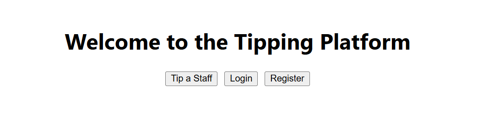
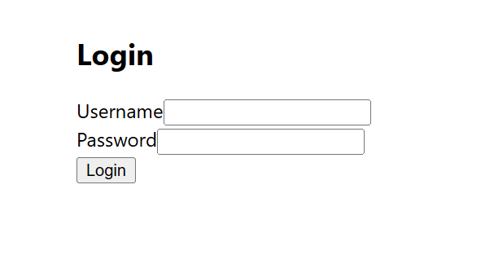
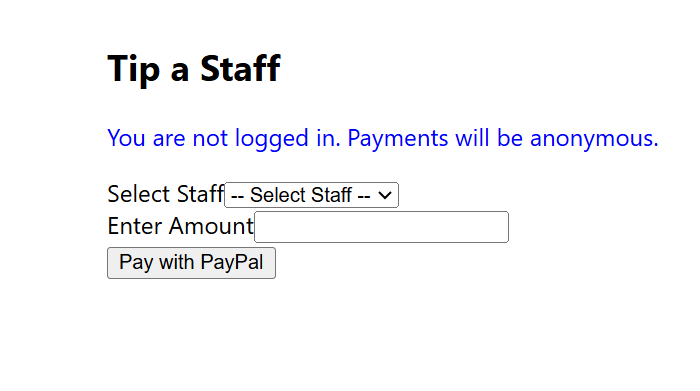

# Paypal Payment Platform

## Project Overview
This project is a tipping platform designed to enable customers to tip restaurant staff seamlessly using PayPal. The platform supports three types of users:
- **Customers**: Can tip staff with or without authentication and view their payment history (if logged in).
- **Staff**: Can receive tips from customers.
- **Restaurant Owners**: Can view all payment details filtered by date, staff, or branch.

The project consists of a **Django Rest Framework (DRF)** backend and a standalone **ReactJS** frontend.

---

## How to Clone the GitHub Repository

1. Open your terminal or command prompt.
2. Run the following command to clone the repository:
   ```bash
   git clone <repository-url>
   ```
3. Navigate to the project directory:
   ```bash
   cd TippingPlatformBackend
   ```

---

## Install and Start the Backend App

### Prerequisites
- Python 3.8+
- pip (Python package installer)
- Virtual environment tool (e.g., `venv` or `virtualenv`)

### Steps
1. Navigate to the backend directory:
   ```bash
   cd tipping_backend
   ```
2. Create and activate a virtual environment:
   - For Windows:
     ```bash
     python -m venv venv
     venv\Scripts\activate
     ```
   - For macOS/Linux:
     ```bash
     python3 -m venv venv
     source venv/bin/activate
     ```
3. Install required dependencies:
   ```bash
   pip install -r requirements.txt
   ```
4. Set up environment variables:
   - Copy `.env.example` to `.env`:
     ```bash
     cp .env.example .env
     ```
   - Update `.env` with your configuration (e.g., PayPal credentials).
5. Run migrations:
   ```bash
   python manage.py migrate
   ```
6. Start the development server:
   ```bash
   python manage.py runserver
   ```

The backend server will be available at `http://127.0.0.1:8000`.

---

## Install and Start the Frontend App

### Prerequisites
- Node.js 16+
- npm (Node Package Manager)

### Steps
1. Navigate to the frontend directory:
   ```bash
   cd tipping-platform-frontend
   ```
2. Install required dependencies:
   ```bash
   npm install
   ```
3. Start the development server:
   ```bash
   npm start
   ```

The frontend app will be available at `http://localhost:3000`.

---

## Features

1. **User Management**:
   - Register as a customer, staff, or restaurant owner.
   - Login with JWT-based authentication.
2. **Payment Integration**:
   - Customers can tip staff using PayPal.
   - Anonymous tipping support.
3. **Payment History**:
   - Customers can view their tipping history.
   - Restaurant owners can filter and search payment records.
4. **Role-Based Access**:
   - Different permissions for customers, staff, and restaurant owners.

---

## Screenshots

Below are some screenshots of the platform:

<div style="display: grid; grid-template-columns: repeat(auto-fit, minmax(300px, 1fr)); gap: 16px;">
  
  
  
</div>

---

Feel free to contribute or raise issues in the repository!
